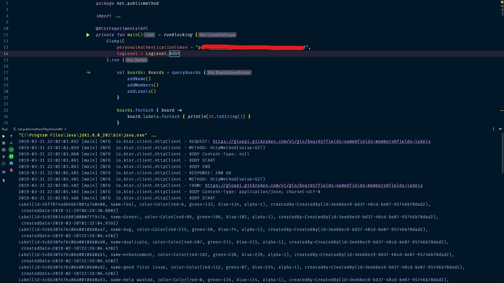

# GloKtor

GloKtor | gl·ok·tor | is a Kotlin Glo Boards SDK featuring a DSL for
building GloAPI GET queries. 

A POST DSLs are coming (_very_) soon!

## In Action
GloKtor in action looks like this:



## USAGE

First we initialize the main interface using
either a [Personal Authentication Token](https://support.gitkraken.com/developers/pats/) or the principle token
returned from an [OAuth 2.0 flow.](https://support.gitkraken.com/developers/oauth/)

``` Kotlin
val glo: GloApi = GloApi(
    personalAuthenticationToken = "some-token-goes-here"
    )
```

Next step is to make a call with the desired parameters:

``` Kotlin
val user: GloUser = glo.queryUser() {
    addName()
    addUserName()
    addEmail()
    addCreatedDate()
}
```

Thanks to the built in anti-corruption layer the returned data classes will
never contain `null` values, just default implementations.

Anything could go wrong while trying to get the data classes directly.
That being the case wrapping the call in a `try catch` is advised.

Alternatively an `HttpResponse` object can be returned.

``` Kotlin
val userRespone: HttpResponse = glo.queryUserResponse() {
    addName()
    addUserName()
    addEmail()
    addCreatedDate()
}
```

## Installation

Fow now the [.jar](jars) has to be added as a dependency to your project.

After that is done you will need to add the following lines to your gradle file:

``` Kotlin
dependencies {
    ...
    implementation 'io.ktor:ktor-client-core-jvm:1.1.2'
    implementation 'io.ktor:ktor-client-logging-jvm:1.1.2'
    implementation 'io.ktor:ktor-client-cio:1.1.2'
    implementation 'io.ktor:ktor-client-json-jvm:1.1.2'
    implementation 'io.ktor:ktor-client-gson:1.1.2'

    implementation 'ch.qos.logback:logback-classic:1.2.1'
    
    compile files('path/to/the/gloktor.jar')

}
```

For now there is a bundling issue preventing me from adding these dependencies to the `.jar`

## TODOS:

 - [ ] Add proper documentation to all the requests
 - [ ] Fix bundling issue
 - [ ] Create demo videos
 - [ ] Add all the POST requests
 - [ ] Add all the DELETE requests
 - [ ] Add `HTTTPResponse` as a return value to all the requests
